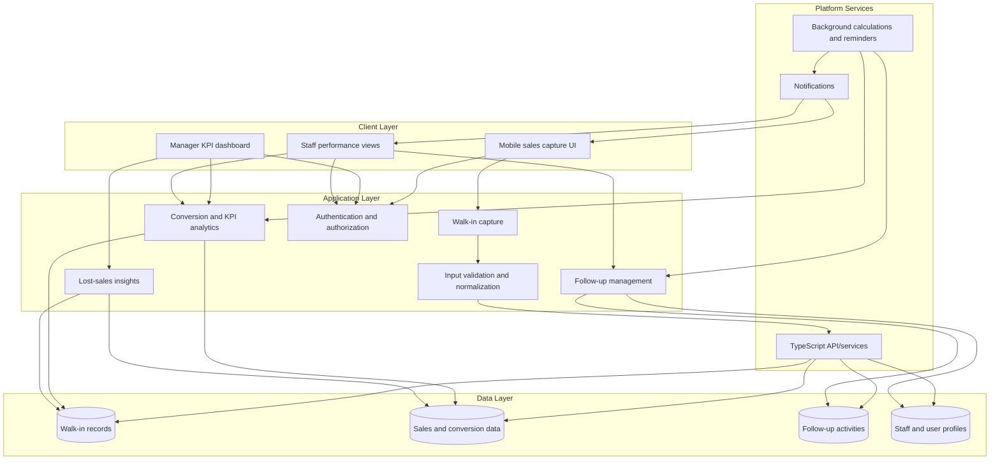

# Architecture Overview

## Flow summary

- Sales staff capture walk-in and customer details through the mobile interface.
- The application validates and normalizes submitted data before persisting it.
- KPI analytics combine walk-in, sales, and activity data to calculate conversion and staff-performance metrics.
- Lost-sales analysis highlights missed opportunities and supports follow-up actions.
- Background jobs refresh derived metrics and reminders, while notifications keep staff informed.
- Authentication and authorization protect staff and management views according to user permissions.
